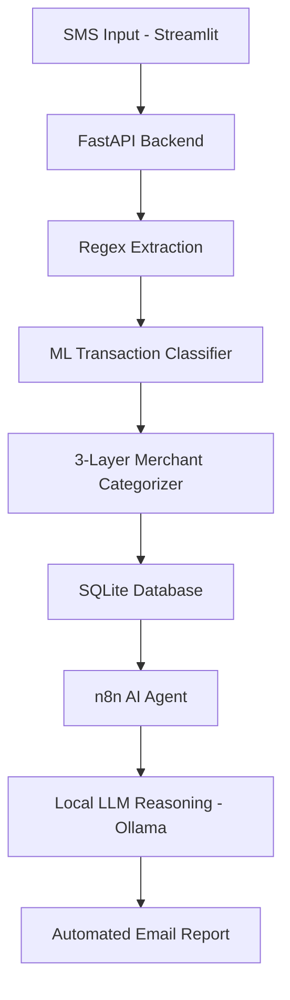

# Masareef AI

**AI-powered financial intelligence for Egyptian bank SMS messages.**

Masareef AI turns raw, unstructured bank SMS notifications into categorized, actionable financial insights — combining machine learning, a layered merchant-intelligence engine, and an autonomous AI agent that delivers proactive spending reports straight to your inbox.

---

## 🎥 Demo

[Link to demo video]


---

## 🧠 What It Does

A user submits a bank SMS (via a custom Streamlit dashboard), and the system:

1. **Extracts** transaction details — merchant, amount, and date — from raw, unstructured text using pattern-based parsing across multiple real Egyptian bank SMS formats (HSBC, NBE, generic Arabic/English).
2. **Classifies** the transaction type (Purchase, Transfer, Salary Credit, ATM Withdrawal) using a TF-IDF + Logistic Regression / Random Forest pipeline, trained on a custom-generated bilingual synthetic dataset.
3. **Categorizes** the merchant through a three-layer intelligence engine:
   - **Layer 1 — Dictionary lookup**: instant, 100%-confidence match against known Egyptian merchants
   - **Layer 2 — Keyword rules**: pattern-based fallback for common but unlisted merchants
   - **Layer 3 — Local LLM fallback**: for genuinely unknown merchants, a locally-hosted Llama 3.2 model (via Ollama) reasons about the category — then permanently caches the answer, so it's never asked twice
4. **Stores** every processed transaction in a SQLite database, building spending history over time.
5. **Reasons and reports**: an n8n-orchestrated AI agent periodically analyzes accumulated spending data, generates a natural-language weekly financial report (top categories, unusual transactions, budgeting tips), and automatically emails it to the user.

---

## 🏗️ Architecture



---

## 🛠️ Tech Stack

| Layer | Technology |
|---|---|
| Backend API | FastAPI |
| ML Classification | scikit-learn (TF-IDF, Logistic Regression, Random Forest) |
| Local LLM | Ollama (Llama 3.2) |
| Database | SQLite |
| Workflow Orchestration | n8n |
| Frontend Dashboard | Streamlit, Plotly |
| Language | Python |

---

## ✨ Key Engineering Decisions

- **Bilingual by design**: built from the ground up to handle both Arabic and English bank SMS formats, reflecting the real mixed-language nature of Egyptian banking communications.
- **Cost-conscious AI usage**: the LLM is a last-resort fallback, not the default path — the vast majority of transactions resolve instantly and for free via dictionary/keyword matching. Caching ensures any given merchant is only ever sent to the AI once.
- **Fully offline and free to run**: no paid APIs anywhere in the pipeline — Ollama runs entirely on local hardware.
- **Rigorously tested generalization**: the ML classifier was validated against hand-written test sentences deliberately excluded from training data, not just synthetic templates — surfacing and fixing real vocabulary and structural gaps before deployment.

---

## 🚀 Running Locally

```bash
git clone https://github.com/khaled-ai-dev/Masareef-ai.git
cd Masareef-ai
python -m venv venv
venv\Scripts\activate
pip install -r requirements.txt

ollama pull llama3.2

uvicorn FastAPI.FastAPI_Backend:app --reload
streamlit run app/streamlit.py
```

n8n workflow setup and Gmail credentials configuration required separately — see `/demo` for a full walkthrough video.

---

## 👤 Author

**Khaled** — Artificial Intelligence student, The British University in Egypt · AI/ML Engineering focus

---

*Built as a portfolio project demonstrating end-to-end ML system design: data generation, model training and validation, production API design, and AI agent orchestration.*
